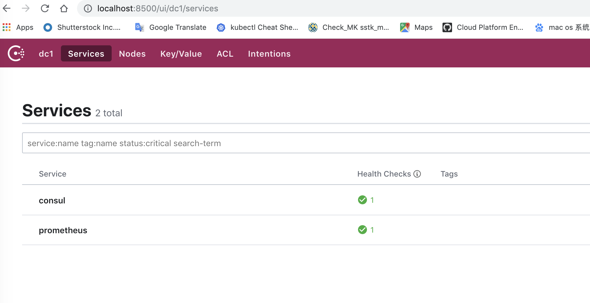

## 1. start consul in master
```
qzhao-mbp:consul qzhao$ ./consul agent -ui --data-dir /tmp/consul --dev -bind '{{GetInterfaceIP "en0"}}' -server --client=0.0.0.0
```

## 2. manually register prometheus of k8s to consul of master

```
./consul services register service.json
./consul services deregister service.json
```
```
qzhao-mbp:consul qzhao$ cat service.json
{
	"service": {
		"name": "prometheus",
		"id": "prometheus",
		"port": 80,
		"address": "prometheus.p8290.us-east-1.kic-sandbox.shuttercloud.org"
	}
}
```


## 3. install influxdb and start in master

```
brew install influxdb
brew services restart/stop/status influxdb
influx
```
```
qzhao-mbp:consul qzhao$ influx
Connected to http://localhost:8086 version v1.7.9
InfluxDB shell version: v1.7.9
> show databases
> auth
username: prom
password:
> use prometheus
> SHOW MEASUREMENTS
```

### create database prometheus in influx
```
curl -XPOST http://localhost:8086/query --data-urlencode "q=CREATE DATABASE prometheus"
```

## 4. build remote_storage_adapter in master

### set go env in .bash_profile
```
export GOPATH=$HOME/go-workspace # don't forget to change your path correctly!
export GOROOT=/usr/local/opt/go/libexec
export PATH=$PATH:$GOPATH/bin
```

### after we get sourcecode of remote_storage_adapter，go will automatically build sourcecode to a file，and save it to $GOPATH/bin/
```
cd /Users/qzhao/go-workspace/bin
go get github.com/prometheus/prometheus/documentation/examples/remote_storage/remote_storage_adapter
```
### start remote_storage_adapter and set username and password of Influxdb：
```
INFLUXDB_PW=prom $GOPATH/bin/remote_storage_adapter --influxdb-url=http://localhost:8086 --influxdb.username=prom --influxdb.database=prometheus --influxdb.retention-policy=autogen
```


## 3. config prometheus.yaml and start in master
```
qzhao-mbp:prometheus-2.13.1.darwin-amd64 qzhao$ cat prometheus.yml
# my global config
global:
  scrape_interval:     15s # Set the scrape interval to every 15 seconds. Default is every 1 minute.
  evaluation_interval: 15s # Evaluate rules every 15 seconds. The default is every 1 minute.
  # scrape_timeout is set to the global default (10s).

# Alertmanager configuration
alerting:
  alertmanagers:
  - static_configs:
    - targets:
      # - alertmanager:9093

# Load rules once and periodically evaluate them according to the global 'evaluation_interval'.
rule_files:
  # - "first_rules.yml"
  # - "second_rules.yml"

#Remote write configuration (for Graphite, OpenTSDB, or InfluxDB).
remote_write:
   - url: "http://localhost:9201/write"

# Remote read configuration (for InfluxDB only at the moment).
remote_read:
   - url: "http://localhost:9201/read"

# A scrape configuration containing exactly one endpoint to scrape:
# Here it's Prometheus itself.
scrape_configs:
  # The job name is added as a label `job=<job_name>` to any timeseries scraped from this config.
  - job_name: 'prometheus'

    honor_labels: true
    metrics_path: '/federate'

    params:
      'match[]':
      - '{job="prometheus"}'
      - '{__name__=~"job:.*"}'
      - '{__name__="up"}'

    consul_sd_configs:
    - server: localhost:8500
      services:
      - prometheus
```
```
qzhao-mbp:prometheus-2.13.1.darwin-amd64 qzhao$ ./prometheus --config.file=prometheus.yml
```


